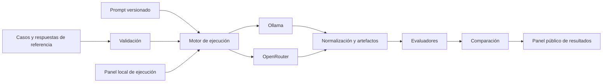

# EvalIA — plan de implementación

Estado: aprobado por el usuario el 3 de octubre de 2026; implementación iniciada por subtareas. Horizonte: 10 a 12 semanas. Presupuesto máximo: USD 30 en total. El avance se registra en `docs/progress.md`.

Avance al 5 de octubre de 2026: los pasos 0 y 1 están completados. El conjunto conserva nueve casos en `reviewed` y `seed-008` en `review_required`; el paquete es instalable y la CLI ofrece ayuda y versión. La siguiente etapa es el validador del paso 2. Todavía no hay ejecuciones ni métricas de modelos.

## 1. Objetivo y usuario

EvalIA permitirá a una persona que desarrolla sistemas de IA comparar modelos y versiones de prompts con casos de prueba en español. Cada ejecución debe poder repetirse y explicar **qué acertó, qué falló, cuánto tardó y cuánto costó**. El repositorio contendrá el motor, un conjunto de referencia, pruebas, documentación y una demostración pública de resultados.

Usuario principal: desarrolladores y equipos pequeños que experimentan con Ollama y proveedores de API. Usuario secundario: estudiantes que quieren aprender a evaluar sistemas de IA con evidencia.

### Decisión de producto

La primera tarea evaluada será **extracción estructurada** de fragmentos de convocatorias: fecha de cierre, modalidad, habilidades requeridas y exigencia de ser estudiante. Es la mejor base inicial porque ofrece respuestas comprobables, una línea base sin IA y métricas claras. El conjunto de referencia estará en español y tendrá casos positivos, ausencias y ambigüedades. El motor deberá aceptar otros conjuntos y tareas después, sin convertir la primera versión en una plataforma genérica.

Habrá dos modos de interfaz: **demo pública de resultados**, accesible por URL y sin inferencia, y **panel web local**, abierto en el navegador de cada usuario, para ejecutar modelos con su Ollama. Ambos compartirán el mismo núcleo Python. Por tanto, en la versión 1 se podrá lanzar una evaluación desde una interfaz web instalada localmente, pero **la URL pública no ejecutará modelos**. Esa distinción es parte de la entrega y de la documentación. Una ejecución remota desde la URL pública requiere otra puerta de seguridad, cuotas y presupuesto.

## 2. Alcance de la versión 1

**Incluye:**

- CLI para validar un conjunto, ejecutar un experimento y comparar dos ejecuciones.
- Adaptador de Ollama y una interfaz de proveedor preparada para ampliaciones. OpenRouter será optativo después de comprobar el recorrido local.
- Un conjunto inicial de **30 a 40 casos revisados**, con al menos 10 ausencias o ambigüedades. La ampliación a 80–100 casos será un objetivo posterior a la primera versión. División de desarrollo y prueba final antes de ajustar prompts.
- Validación estructural, puntuación por campo, evidencia, tasa de abstención correcta, latencia, tokens y costo de API cuando el proveedor lo informe.
- Artefactos de ejecución versionados, panel público de solo lectura con resultados precomputados y panel local para lanzar ejecuciones desde el navegador.
- Pruebas automáticas, documentación reproducible y una demo con ejemplos de errores.

**Fuera de la versión 1:** extracción automática masiva de sitios, RAG, agentes, cuentas, ejecución de modelos desde la URL pública, ajuste fino, clasificación universal de modelos y microservicios.

## 3. Recorrido de uso

1. La persona prepara un archivo JSONL de casos con texto, valores esperados y evidencia.
2. `evalia validate` revisa el archivo y señala campos o referencias incorrectos.
3. `evalia run` toma una versión de prompt, un modelo y una configuración; envía cada caso mediante el adaptador elegido.
4. El sistema conserva respuesta original, salida normalizada, errores, tiempos, uso y versiones.
5. Los evaluadores aplican reglas deterministas; los casos semánticamente ambiguos quedan marcados para revisión humana.
6. `evalia compare` genera métricas por campo y una lista de regresiones/mejoras caso por caso.
7. El panel local, enlazado solo a `localhost`, permite lanzar una ejecución tras un clic explícito. El panel público permite filtrar, comparar y abrir ejemplos precomputados. Una selección de ejecuciones se publica mediante una lista permitida de campos, sin secretos ni datos privados.



## 4. Contratos de datos y evaluación

### Caso de prueba

Cada caso tendrá `id`, `text`, `source_url` opcional, `source_license`, `redistribution_allowed`, `split`, `expected` y `evidence`. Cada valor no nulo tendrá una cita literal propia y su posición inicial/final en `text`; cuando no haya respaldo se marcará `null`. Los campos esperados serán:

La estructura autoritativa se define en `schemas/evalia-case.schema.json` y sus reglas semánticas en `docs/annotation-guide.md`. La subtarea 0.1 incorpora `schema_version` y `review_status` para registrar versión y exclusión de borradores o conflictos. Los modelos Python posteriores deberán cumplir ese contrato.

- `closing_date`: fecha ISO o `null`.
- `modality`: `remota`, `hibrida`, `presencial` o `null`.
- `skills`: lista de términos normalizados.
- `student_required`: `true`, `false` o `null` para distinguir ausencia de una negativa explícita.

La guía de anotación fijará las decisiones difíciles: si una fecha no trae año, `closing_date=null`; ante dos fechas de cierre contradictorias se marcará el caso para revisión y no se puntuará hasta resolverlo; habilidades equivalentes se mapearán mediante un vocabulario versionado (por ejemplo, `Python 3`→`Python`), sin equivalencias inferidas a mano después de ver resultados. `false` para `student_required` solo significa una negación explícita; si no se menciona, corresponde `null`.

Antes de publicar textos de terceros se comprobarán sus condiciones de reutilización. Los casos sin permiso verificable tendrán `redistribution_allowed=false` y no podrán entrar al conjunto público. Se preferirán textos creados para el proyecto, con una muestra limitada de fragmentos públicos enlazados y autorizados. El conjunto de prueba final se congelará antes de escoger el prompt final; cualquier corrección posterior del gold set tendrá versión nueva y motivo registrado.

### Métricas

| Medida | Regla inicial | Interpretación |
| --- | --- | --- |
| Validez estructural | Respuesta parseable y conforme al esquema | Fiabilidad de integración |
| Fecha y modalidad | Coincidencia exacta tras normalización documentada | Extracción verificable |
| Habilidades | Precisión, cobertura y F1 de conjunto, con vocabulario documentado | Omisiones e invenciones |
| Requisito de estudiante | Exactitud ternaria (`true`/`false`/`null`) | Distinguir negación de desconocimiento |
| Evidencia | La cita y sus posiciones corresponden a la entrada; revisión humana de al menos 10 casos de la comparación final para comprobar respaldo semántico | Trazabilidad, no prueba automática de veracidad |
| Abstención | Proporción de campos ausentes que el modelo deja en `null` | Resistencia a inventar datos |
| Latencia y uso | Tiempo por solicitud, tokens y costo informado por proveedor | Eficiencia bajo condiciones registradas |

No habrá una única puntuación compuesta que oculte fallos importantes. Se publicarán conteos y denominadores. Para comparar modelos se usará el mismo conjunto, prompt y límites de salida cuando sean compatibles; las diferencias de formato forzado y hardware se documentarán. Una muestra de casos se repetirá tres veces para observar estabilidad; no se asumirá que una corrida representa toda la variabilidad.

### Artefacto de ejecución

Cada ejecución guardará manifiesto con fecha, commit, hash del conjunto y prompt, proveedor, identificador exacto del modelo, parámetros, versión de EvalIA, entorno local, duración, uso y errores. Las respuestas originales y evaluadas irán en JSONL. Las claves nunca se guardarán en artefactos ni logs. El exportador público usará una **lista permitida** (`case_id`, etiquetas publicables, predicción, puntajes, metadatos de modelo y tiempo) y rechazará casos con `redistribution_allowed=false`. Habrá una revisión manual del artefacto exportado antes del despliegue.

## 5. Arquitectura y tecnologías

Un **monolito modular** mantiene una sola base de código y contratos claros:

```text
EvalIA/
  pyproject.toml
  src/evalia/
    domain/          # esquemas, contratos y normalización
    providers/       # Ollama, OpenRouter y proveedor simulado
    runner/          # ejecución, límites, reintentos y manifiesto
    graders/         # métricas deterministas y revisión manual
    reports/         # comparación y exportación
    cli.py
  datasets/           # ejemplos y conjunto de referencia versionado
  prompts/            # prompts versionados
  app/                # panel Streamlit de solo lectura
  tests/              # unitarias e integración con proveedor simulado
  examples/results/   # ejecuciones públicas seleccionadas
  docs/               # método, arquitectura, límites y tutorial
  plans/
```

| Elección | Uso | Motivo |
| --- | --- | --- |
| Python 3.11+ y `pyproject.toml` | Paquete y CLI | Prioriza aprendizaje de Python y distribución sencilla. |
| Pydantic | Esquemas de entrada/salida | Fallos explícitos y contrato verificable. |
| Typer | CLI | Comandos claros para terceros. |
| `httpx` | Adaptadores HTTP | Control directo de tiempo de espera y errores. |
| JSONL | Casos y respuestas crudas | Fácil de revisar, versionar y procesar. |
| DuckDB | Consultas para reportes | Análisis local sin base de datos administrada. No se requiere para el primer recorrido completo. |
| Streamlit | Demo pública y panel web local | Un mismo código con modo público de lectura y modo local de ejecución; el modo público no importa ni instancia proveedores. |
| pytest y Ruff | Pruebas y calidad | Verificación repetible en local y CI. |
| GitHub Actions | Validación del repositorio | Ejecuta pruebas con proveedor simulado; nunca gasta créditos de OpenRouter en PRs. |

No se añadirá LangChain, base vectorial, Docker ni FastAPI al inicio. Se reconsiderarán solo si un caso de uso real los exige. La interfaz `ModelProvider` permitirá agregar proveedores sin importar dependencias de red dentro de los evaluadores.

## 6. Secuencia de construcción y puertas de salida

Cada paso se divide en subtareas revisables. El usuario autorizó la creación del repositorio público en GitHub y el registro del trabajo mediante commits. Se usa GitHub Flow: documentación inicial en `main`, después ramas cortas y pull requests por subtarea. La siguiente tabla indica dependencias; las fichas posteriores dejan el contexto para retomar el trabajo en otra sesión.

| Paso | Semanas | Depende de | Entregable verificable |
| --- | --- | --- | --- |
| 0. Contrato | 1 | — | Rúbrica, esquema y 10 casos de arranque. |
| 1. Base del repositorio | 1–2 | 0 | Paquete instalable, CLI mínima, pytest, Ruff y README. |
| 2. Validación | 2–3 | 0–1 | `evalia validate` y normalizadores probados. |
| 3. Puntuación | 3–4 | 2 | Evaluadores y línea base determinista. |
| 4. Ejecución | 4–5 | 2–3 | Motor con proveedor simulado, manifiesto y respuestas crudas. |
| 5. Ollama y datos | 5–7 | 0, 2, 4 | Adaptador local y 30–40 casos revisados con división dev/test. |
| 6. Comparación y exportación | 7–8 | 3–5 | `evalia compare`, reportes y exportación pública segura. |
| 7. Panel web local | 8–9 | 5–6 | Lanzamiento de ejecuciones con Ollama desde navegador local. |
| 8. Demo pública e integración | 9–11 | 6–7 | Panel de solo lectura, CI, instalación limpia, documentación y publicación. |
| 9. OpenRouter optativo | 11–12 | 4, 6, 8 | Adaptador y comparación remota solo si pasan costo, tiempo y seguridad. |

**Ruta crítica:** 0→1→2→3→4→5→6→7→8. El paso 9 no bloquea la entrega. Se reserva la semana 11 para integración y corrección de fallos; la semana 12 es margen o ampliación. La meta de 80–100 casos queda para la siguiente iteración, después de que el primer conjunto demuestre utilidad.

### Fichas de ejecución

**0. Contrato y 10 casos.** Contexto: las métricas solo tendrán sentido si las respuestas esperadas están definidas antes de probar modelos. Subtarea 0.1: crear `docs/annotation-guide.md` y `schemas/evalia-case.schema.json`. Subtarea 0.2: crear `datasets/seed.jsonl` con 2 casos sin fecha, 2 sobre requisito de estudiante ausente o negado y 1 contradictorio marcado para revisión. Subtarea 0.3: verificar manualmente que cada valor no nulo tenga cita y posición; una segunda lectura diferida, al menos 24 horas después de crear los casos, corregirá inconsistencias registradas. Salida: 10 casos conformes y una tabla de decisiones de anotación; el conflicto pendiente se excluye de métricas. Si se cambia un campo, versionar el esquema y volver a revisar los 10 casos.

**1. Base instalable.** Contexto inicial: todavía no existía código. Subtarea 1.1: crear `pyproject.toml`, el paquete `src/evalia`, `tests/`, `.gitignore`, README y configuración de Ruff/pytest; verificar instalación editable, importación, pruebas y lint. Subtarea 1.2: añadir `src/evalia/cli.py` con una CLI mínima y comprobar `evalia --help` desde una instalación limpia. Salida: comandos funcionales sin red ni claves. Si una dependencia complica la instalación, retirarla antes de continuar.

**2. Validador.** Contexto: consume el contrato del paso 0. Se divide en entregas verificables:

- **2.1. Lectura y estructura:** incorporar el esquema autoritativo a la distribución, leer JSONL línea por línea y ofrecer `evalia validate` con errores de sintaxis o contrato que indiquen línea, caso y campo. Comprobar el conjunto inicial, fecha sin año, valor desconocido y la diferencia estructural entre `null` y `false`.
- **2.2. Coherencia del conjunto y evidencia:** comprobar IDs y textos únicos, texto no vacío en contenido, correspondencia entre habilidades y sus citas, rangos y citas literales exactas en Unicode. Probar errores con línea/caso, incluida una cita fuera de rango. La coincidencia literal no se presentará como revisión del respaldo semántico.
- **2.3. Normalización documentada:** añadir normalizadores deterministas de fechas y vocabulario de habilidades, con reglas versionadas, ejemplos y pruebas. Ejecutar la verificación completa del conjunto inicial y de casos negativos antes de cerrar el paso.

Salida: el archivo correcto pasa y cada archivo malo falla por la razón prevista. Si cambia el contrato, actualizar guía y casos antes de tocar métricas.

**3. Evaluadores.** Contexto: puntuar salidas validadas, sin dependencia de proveedor. Implementar métricas por campo, abstención, evidencia literal y una línea base por reglas; separar errores de formato de errores de contenido. Verificar `python -m pytest tests/graders` con casos conocidos y un reporte de la línea base. Salida: cada métrica muestra numerador, denominador y casos fallidos; cero divisiones se informan como no aplicables, no como 100 %. Si la rúbrica cambia, recalcular todas las ejecuciones comparadas.

**4. Motor.** Contexto: conecta casos, prompt y proveedor, y deja rastro de cada solicitud. Implementar `ModelProvider`, proveedor simulado, `evalia run`, tiempo de espera, reintentos acotados, manifiesto y escritura incremental de resultados. Verificar `python -m pytest tests/runner` y una ejecución interrumpida simulada. Salida: los casos completados y fallidos siguen siendo auditables; no aparece ninguna variable secreta en logs. Si una ejecución falla, conservar el artefacto y corregir el motor antes de sumar proveedores.

**5. Ollama y conjunto inicial.** Contexto: primer recorrido real de costo cero. Implementar el adaptador Ollama y una prueba de humo de 10 casos; registrar modelo exacto, memoria disponible y tiempos. Ampliar a 30–40 casos siguiendo la guía; reservar aproximadamente 25 % como prueba final congelada y revisar de nuevo al menos 20 % del conjunto tras 24 horas. Verificar `evalia validate datasets/benchmark-v1.jsonl` y dos ejecuciones con modelos o configuraciones locales. Salida: resultados comparables y ninguna llamada remota obligatoria. Si el hardware no permite dos modelos, comparar dos versiones de prompt con el mismo modelo y declarar esa limitación.

**6. Comparar y publicar datos seguros.** Contexto: las ejecuciones del paso 5 deben convertirse en decisiones legibles. Implementar `evalia compare`, lista de regresiones/mejoras y `evalia export-public`. Verificar pruebas de comparación y una prueba que intente exportar un caso con `redistribution_allowed=false` y sea rechazada. Revisar manualmente el JSON exportado. Salida: informe por campo y por caso sin secretos ni textos restringidos. Si cambia el gold set, invalidar comparaciones anteriores o indicar claramente la versión distinta.

**7. Panel web local.** Contexto: reutiliza el motor; no crea lógica de evaluación nueva. Añadir modo local de Streamlit con selección de datos, prompt, modelo y límite de casos, más botón explícito para ejecutar. Enlazar solo a `localhost`; un rerun de Streamlit no debe repetir solicitudes. Verificar manualmente una ejecución de 10 casos y una prueba automática del controlador de ejecución. Salida: resultados consultables desde navegador local, incluso si no hay OpenRouter. Si la interfaz retrasa la entrega, reducir gráficos antes de tocar el motor.

**8. Demo pública e integración.** Contexto: usa únicamente exportaciones del paso 6. Añadir modo público que no importe ni instancie proveedores y no acepte claves; seleccionar dos ejecuciones comparables, mostrar filtros y casos fallidos, documentar instalación y límites, y configurar CI sin llamadas pagadas. Verificar instalación limpia, `python -m pytest`, `ruff check .`, prueba que bloquea ejecución en modo público y revisión manual de enlaces/artefactos. Publicar solo tras comprobar derechos de reutilización de cada caso. Salida: URL de demo y release inicial reproducible. Si Streamlit Cloud resulta insuficiente, exportar un reporte estático.

**9. OpenRouter optativo.** Contexto: una comparación remota puede enriquecer el portafolio, pero no determina si EvalIA funciona. Antes de activar llamadas, estimar tokens/costo por caso, fijar número máximo de casos y salida, límites de reintentos y tope acumulado de clave sin reinicio. Implementar adaptador y pruebas con respuestas simuladas; correr primero 3 casos y revisar uso real. Salida: comparación adicional dentro del presupuesto. Si el costo o el plazo no pasan la puerta, registrar la decisión y mantener la versión local.

### Control de cambios del plan

Después de cada paso, actualizar este archivo con estado, fecha, evidencia de verificación y cualquier decisión que cambie alcance o dependencias. Un paso que no pasa su puerta no se declara completo; se corrige, se divide o se pospone con motivo explícito. No se publican métricas de modelos hasta que el conjunto de prueba esté congelado.

## 7. Presupuesto y privacidad

- Obligatorio: USD 0 para desarrollo local, pruebas y demo precomputada.
- OpenRouter: optativo, con presupuesto interno inicial de USD 20 y USD 10 de reserva; no comprar créditos ni ejecutar lotes pagados hasta estimar costo por caso.
- Si se usa OpenRouter, crear una clave específica con límite de gasto **sin reinicio** y guardar el secreto solo en variables de entorno locales. Mantener un registro de gasto acumulado. El comando exige confirmación explícita antes de un lote remoto y calcula un máximo estimado con número de casos, límite de salida y reintentos; corta al llegar al tope. Si el proveedor no informa uso o precio, registrar `desconocido`, nunca USD 0.
- No subir currículums, postulaciones privadas ni textos personales al conjunto público. La demo alojada leerá únicamente resultados publicados.
- Los modelos locales tienen costo de electricidad y hardware que no se incluirá en el costo de API; se declarará esta limitación.

## 8. Riesgos y decisiones abiertas

| Riesgo | Respuesta |
| --- | --- |
| Hardware insuficiente para cierto modelo | Probar un modelo pequeño con 10 casos antes de escoger la comparación; no fijar modelo por anticipado. |
| Conjunto demasiado fácil o sesgado | Incluir casos negativos, fechas variadas, textos ruidosos y fuentes distintas; publicar composición y límites. |
| Respuestas de referencia equivocadas | Guía de anotación, revisión diferida de muestra y registro de correcciones. |
| Métrica de evidencia superficial | Separar coincidencia literal de respaldo semántico; muestreo humano para lo segundo. |
| API o tarifas cambian | Versionar adaptador, consultar precio al ejecutar, tope de gasto y posibilidad de operar solo con Ollama. |
| Demo pública supera recursos gratuitos | Publicar reportes estáticos como alternativa; no depender de inferencia en la nube. |
| Una web pública ejecuta llamadas por error | Modo público sin instanciación de proveedores, prueba de prohibición de ejecución y despliegue sin secretos. |
| Streamlit repite llamadas por su ciclo de rerun | Acción iniciada por botón y registrada con identificador de ejecución; reabrir la vista solo lee artefactos. |

Decisión de evolución: si después de publicar la versión 1 se quiere **ejecutar modelos desde la URL pública**, diseñar una fase separada con aislamiento de claves del usuario, límites por persona, cuotas, protección contra abuso y cálculo de costo. No forma parte de los criterios de cierre de esta versión porque un servicio abierto de inferencia podría agotar los USD 30 o exponer secretos. Se revisará esa posibilidad en la semana 8, cuando existan datos reales de costo y tiempo, sin comprometer la publicación del núcleo.

## 9. Primer trabajo recomendado

Comenzar por el paso 0: escribir la rúbrica y 10 casos pequeños, incluidos al menos dos sin fecha, dos con negación/ausencia de requisito y uno con requisitos contradictorios. Después crear el validador y una línea base sencilla. Si este recorrido no produce errores interpretables, corregir el contrato antes de conectar modelos o diseñar el panel.

## Fuentes técnicas consultadas

- Ollama Chat API: https://docs.ollama.com/api/chat
- OpenRouter Chat API: https://openrouter.ai/docs/api/api-reference/chat/send-chat-completion-request
- OpenRouter límites de clave: https://openrouter.ai/docs/api/api-reference/api-keys/create-keys
- Pydantic: https://docs.pydantic.dev/latest/concepts/models/
- DuckDB Python: https://duckdb.org/docs/stable/clients/python/overview
- Streamlit Community Cloud: https://docs.streamlit.io/deploy/streamlit-community-cloud/manage-your-app
- GitHub Actions: https://docs.github.com/en/billing/concepts/product-billing/github-actions
